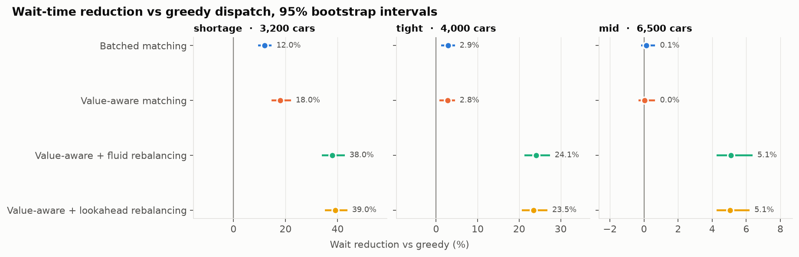
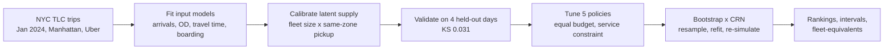
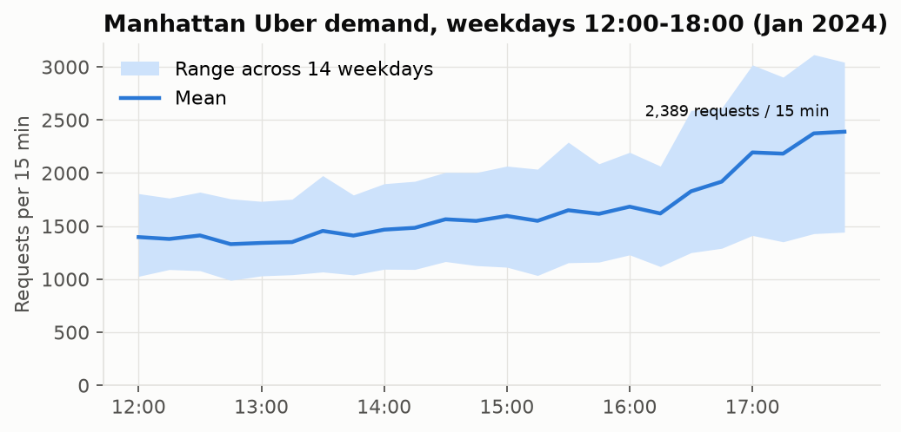
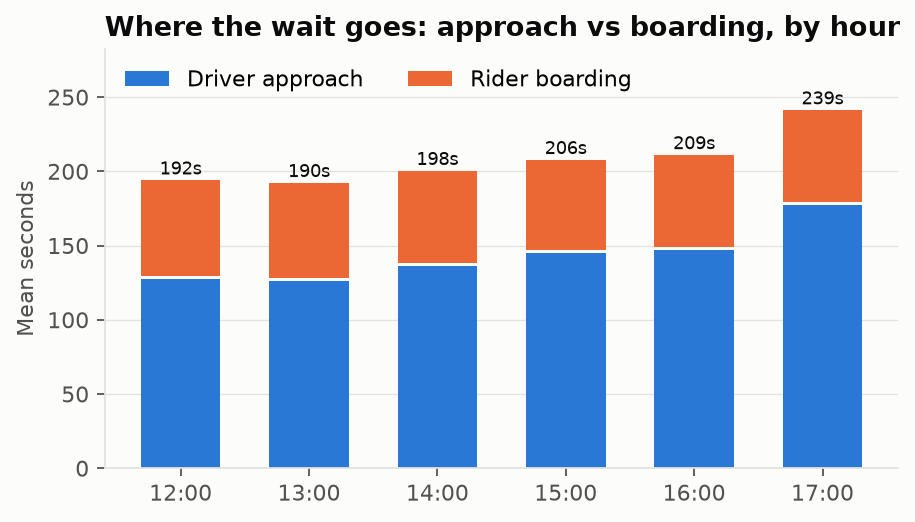
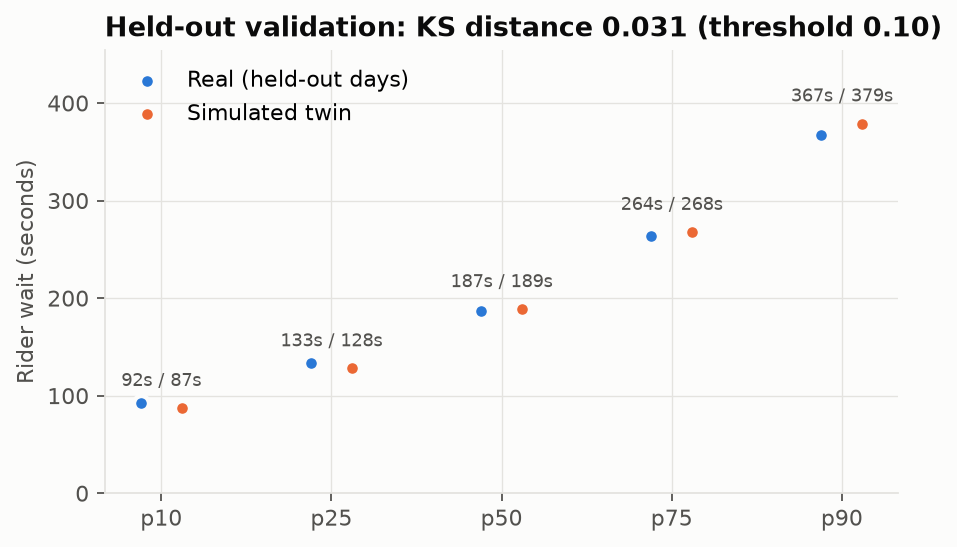
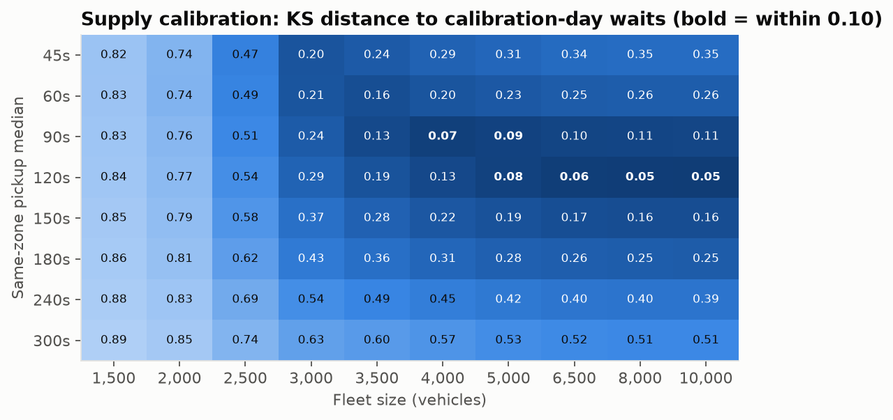

# Fleet Dispatch Optimization Under Input Model Uncertainty

[](https://github.com/shadowPunch/fleet-optimization/actions/workflows/ci.yml)

Which dispatch algorithm should a ride-hailing platform run, and how sure can
it be? This project builds an event-driven digital twin of Uber's Manhattan
market from 556,000 real NYC trips, validates it on days it never saw, and
compares five dispatch algorithms with the uncertainty in every fitted input
model propagated into the answer.



## Results

- **The twin reproduces real waits on held-out days.** Kolmogorov-Smirnov
  distance 0.031 against a pre-registered 0.10 threshold; median wait 189s
  simulated vs 187s real, p90 379s vs 367s. The first version failed this
  test (KS 0.74); the fix, and the reason, are in the
  [technical documentation §5.5](TECHNICAL_DOCUMENTATION.md#55-p1--validation-against-real-data).
- **Rebalancing idle cars is where the value is, and it depends on supply.**
  It cuts waits by 39% with 3,200 cars, 24% with 4,000, 5% with 6,500 and 1.6%
  with 10,000, while serving more riders, not fewer. Smarter matching alone
  (batched Hungarian, value-function-aware) helps only under real scarcity
  (12-18%).
- **The best algorithm changes with supply, and near the top it can't be
  named.** Lookahead rebalancing wins every bootstrap draw at 3,200 cars,
  fluid rebalancing every draw at 4,000; at 6,500+ the two are statistically
  tied.
- **Single-run point estimates pick the wrong winner** in two of the four
  regimes, which is why every comparison here is a paired bootstrap interval.
- **Priced in cars:** with a driver shortage, greedy dispatch would need at
  least 3,100 more cars (about double the fleet) to match either rebalancing
  policy.

**Full results dashboard:** [PDF](docs/dashboard.pdf), or the interactive
[`docs/dashboard.html`](docs/dashboard.html) (download and open in a browser;
it is one self-contained file). **Detailed documentation:**
[TECHNICAL_DOCUMENTATION.md](TECHNICAL_DOCUMENTATION.md).

| Supply (cars) | Greedy wait | Best policy | Wait cut vs greedy | Riders served (best vs greedy) |
|---|---|---|---|---|
| 3,200 (shortage) | 314s | lookahead rebalancing (100% of draws) | 39% | 91.0% vs 87.4% |
| 4,000 | 240s | fluid rebalancing (100% of draws) | 24% | 91.9% vs 90.3% |
| 6,500 | 231s | fluid ≈ lookahead (tied) | 5% | 91.7% vs 91.3% |
| 10,000 | 222s | fluid ≈ lookahead (tied) | 1.6% | 91.7% vs 91.6% |

## How it works



- **Simulator:** discrete-event (heap-based), 69 TLC zones, 5-second dispatch
  ticks, non-homogeneous Poisson demand per zone and 15-minute bin, lognormal
  zone-to-zone travel times, empirical boarding delays, rider abandonment.
- **Algorithms:** greedy nearest vehicle; batched optimal matching
  (Hungarian); value-aware matching with a backward-induction value function
  over zones; fluid rebalancing (a transportation LP toward demand share); and
  Monte Carlo lookahead rebalancing.
- **Uncertainty:** each bootstrap draw resamples the trips and refits every
  input model; all policies then run on identical request streams (common
  random numbers), so differences are paired. A policy is called better only
  when its interval excludes zero; otherwise the tied set is reported.
- **Scale:** exact zone-level reductions (interchangeable vehicles, candidate
  pruning, a totally unimodular transportation LP) cut a simulated NYC hour
  from 7.4s to 0.9s with bit-identical decisions; the ~5,000 six-hour
  simulations per regime ran as parallel Kaggle jobs, shardable by draw range
  and checkpointed.

## Data exploration

| | |
|---|---|
|  |  |
|  |  |

## Run it

Requires Python 3.12+ and [uv](https://docs.astral.sh/uv/).

```bash
uv sync
uv run pytest -q                    # 265 tests, synthetic data only, ~50s
uv run dispatch-eval validate       # calibrate + held-out validation (~15 min)
uv run dispatch-eval eda            # exploratory tables of the real data
uv run dispatch-eval study --regime tight --workers 8   # one supply regime (hours)
uv run dispatch-eval report --pdf   # every figure + docs/dashboard.{html,pdf} from results/
```

The first command that needs data downloads the January 2024 TLC file once and
caches the study window under `data/cache/` (no account needed). Scope, splits,
grids, regimes and budgets are in [`configs/nyc.yaml`](configs/nyc.yaml).

- **Experiment tracking:** every calibration, validation and study run is a
  Weights & Biases run (project `fleet-dispatch-eval`); `DISPATCH_WANDB=0`
  turns it off.
- **Kaggle:** `kaggle/push.sh` uploads the package and data as a private
  dataset and starts one job per regime (or per draw shard with
  `SHARDS="0:50 50:100"`); `kaggle/pull.sh <job>` downloads results and syncs
  the offline W&B runs; `dispatch-eval merge` combines shards.

## Repository

```
src/dispatch_eval/
  simulator/     event-driven engine, vehicles and requests
  policies/      the five dispatch policies, zone-level solvers, registry
  calibration/   fitting every input model; supply calibration; tuning
  studies/       NYC data, validation, policy study, EDA, figures, dashboard
  ranking_flip.py  bootstrap x common-random-numbers experiment harness
  cli.py           dispatch-eval command line
configs/nyc.yaml the whole NYC study's settings
kaggle/          remote execution scripts
analysis/        earlier synthetic-data experiments (see the technical report)
tests/           265 tests
```

[TECHNICAL_DOCUMENTATION.md](TECHNICAL_DOCUMENTATION.md) has the architecture and its
design decisions, the algorithms, the full methodology, every result
(including the synthetic-data studies that preceded the NYC work),
limitations, and reproduction steps.

## Limitations

Wait data pins down the fleet size only from below (any fleet of ~4,000+ fits),
so results are reported across that range. Zones are treated as points, rider
patience is assumed (NYC publishes no cancellations), and the data covers one
operator on January 2024 weekday afternoons. Details:
[technical documentation §7](TECHNICAL_DOCUMENTATION.md#7-limitations).
